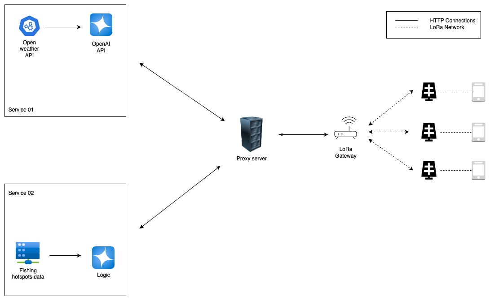

# FISHING HOTSPOTS LOGIC

## Description

This is a logic that develops a fishing spot prediction system to help anglers identify optimal fishing locations. The logic considers factors such as fuel efficiency, environmental sustainability, and adaptive learning from historical data to suggest productive fishing spots while balancing ecosystem impact.

## System Diagram



## Usage

The system provides an API that can be queried with a latitude and longitude to receive recommendations on the best fishing locations. The logic takes into account recent activity and visit patterns to distribute fishermen evenly and conserve fish populations. Additionally, the system learns over time, adjusting hotspots based on live fishing patterns.

## Installation

### For macOs:

1. Rename .example.env file into .env and fill the reqeusted configuration within the file
2. Create python virtual environment `python3 -m venv venv`
3. Active the virtual environment `source venv/bin/activate`
4. Command to diactivate the virtual environment (if needed) `deactivate`
5. Install all the dependencies `pip install -r requirements.txt`
6. Start the server `uvicorn app.main:app --reload`

### Other commands:

1. Generate the requirements.txt file `pip freeze > requirements.txt`

## API Integration

### Save Fishing Location

- **Endpoint: POST /save_fishing_location**
- This API endpoint is used to save fishing hotspot data to the database.
- Requested Parameteres:

  - id (string): Vessel ID and Message ID separated by a |
  - l (string): Latitude and Longitude saparated by a hyphen |
  - f (integer): Indicator (used to mark whether this is a fishing hotspot message)

- Reqeusted Body Example:

  ```
  {
    "id": "123|4567",
    "l": "12.2323|34.23432",
    "f": 1
  }
  ```

- Response:

  - Success:

    ```
    {
      "status": "success",
      "message": "Fishing location saved successfully",
      "data": {
        "vesselId": "123",
        "messageId": "4567",
        "latitude": 12.2323,
        "longitude": 34.23432,
        "currentDateTime": "2024-11-25T15:30:00.123456",
        "status": "active",
        "f": 1,
        "_id": "6521c7d7afdbf3e4d8a75f4a"
      }
    }
    ```

  - Failure (Duplicate Location):

    ```
    {
      "status": "failed",
      "message": "Location already exists within the specified radius.",
      "radius": 20
    }
    ```

### Get Fishing Hotsposts Locations

- **Endpoint: GET /get_fishing_locations**
- This API endpoint retrieves fishing location details based on the specified time period or date range.
- Query Parameters:

  - period (string) _(optional)_: Filtered by predefined periods:
    - "month": Locations from the last 30days.
    - "year": Locations from the current year.
    - "last year": Locations from the previous year.
  - start*date (string) *(optional)\_: Custom start date in YYYY-MM-DD format.
  - end*date (string) *(optional)\_: Custom end date in YYYY-MM-DD format.

- if period is provided, start_date and the end_date are ignored.
- Query parameter Examples:

  - Get locations for the last month:

    ```
    /get_fishing_locations?period=month
    ```

  - Get locations for this year:

    ```
    /get_fishing_locations?period=year
    ```

  - Get locations for last year:

    ```
    /get_fishing_locations?period=last%20year
    ```

  - Get locations for a custom date range:

    ```
    /get_fishing_locations?start_date=2024-10-01&end_date=2024-12-01
    ```

- Response:

  - Success:

    ```
    {
      "status": "success",
      "data": [
        {
          "vesselId": "123",
          "messageId": "456",
          "latitude": 12.2323,
          "longitude": 34.23432,
          "currentDateTime": "2024-11-01T12:00:00",
          "status": "active",
          "f": 1
        },
        {
          "vesselId": "789",
          "messageId": "012",
          "latitude": 12.2330,
          "longitude": 34.23450,
          "currentDateTime": "2024-11-05T14:00:00",
          "status": "active",
          "f": 1
        }
      ]
    }
    ```

  - Faliure:

    ```
    {
      "status": "error",
      "message": "An error occurred: <error_details>"
    }
    ```

### Link vessel with the hotspots

- **Endpoint: POST /link_vessel_to_hotspot**
- This API endpoint link the vessels with the hotspots. Once it linked there is a shedular function its check whether the linked vessel is active time to time. With if not active the status is filed will go to 0. That means that hotspot can be use another vessel.
- Query Parameters:

  - vessel_id: The vessel id that need to be allocated to the hotspot.
  - hotspot_id: The id of thr hotspot that vessle going to be allocated.

- Requested Body Example:

  ```
  {
      "vessel_id": "Vessel123",
      "hotspot_id": 1
  }
  ```

- Response:

  - Sucess:

    ```
    {
        "status": "success",
        "message": "Vessel linked to hotspot successfully",
        "data": {
            "vesselId": "Vessel123",
            "hotspotId": 1,
            "dateTime": "2024-11-28T13:40:24.289108",
            "status": 1,
            "_id": "6748257037990298c1c5d936"
        }
    }
    ```

  -
  - Faliure:

    ```
    {
        "status": "failed",
        "message": "Vessel Vessel123 is already linked to hotspot 1 and is active."
    }
    ```

### Un-link vessel from any active hotspot(s)

- **Endpoint: PATCH `/unlink_vessel_to_hotspot`**
- This endpoint removes (sets `status = 0`) every _active_ link between the given vessel and any hotspot.
  If the vessel is already free (no active links), the call returns a _failed_ status instead of silently succeeding.
- **Body parameters** (JSON):
  - `vessel_id` – **string** – ID of the vessel whose active hotspot links should be cleared.
- **Request body example**
  ```json
  {
    "vessel_id": "Vessel123"
  }
  ```
- **Responses**
  - **Success** – at least one active link was found and deactivated
    ```json
    {
      "status": "success",
      "message": "1 hotspot link(s) unlinked for vessel Vessel123."
    }
    ```
  - **Failure** – no active links exist for that vessel
    ```json
    {
      "status": "failed",
      "message": "No active hotspot links found for vessel Vessel123."
    }
    ```
  - **Error** – unexpected server-side problem (example)
    ```json
    {
      "detail": "An unexpected error occurred: <error message>"
    }
    ```

### Suggest the latest hotspots

- **Endpoint: GET /suggest_fishing_hotspots**
- This API endpoint gives the currently avaialbe latest saved best fishing hotspots.
- Query Parameters:

  - ```
    /suggest_fishing_hotspots?latitude=37.7749&longitude=-122.4194
    ```

- Response:

  - Success:

    ```
    {
        "status": "success",
        "message": "Latest suggested fishing hotspots retrieved successfully.",
        "data": [
            {
                "hotspotId": 2,
                "latitude": 13.23,
                "longitude": 34.23,
                "currentDateTime": "2024-11-28T13:06:02.968787",
                "vesselCount": 0,
                "availableSlots": 5
            },
            {
                "hotspotId": 1,
                "latitude": 12.23,
                "longitude": 34.23,
                "currentDateTime": "2024-11-28T13:05:50.957204",
                "vesselCount": 1,
                "availableSlots": 4
            }
        ]
    }
    ```

  - Faliure:

    ```
    {
        "detail": "Not Found"
    }
    ```

### Save vessel location

- **Endpoint: POST /save_vessel_location**
- This API endpoint is used to save the vessels locations time-to-time in the database
- Reqested Parameters:

  - id (string): Vessel ID and Message ID separated by a |
  - l (string): Latitude and Longitude saparated by a |

- Requested Body Example:

  ```
  {
      "id": "123|0000",
      "l": "80.12321|13.32432"
  }
  ```

- Response:

  - Success:

    ```
    {
        "status": "success",
        "message": "Vessel location saved successfully.",
        "data": {
            "vesselId": "123",
            "dateTime": "2024-11-29T04:06:02.299424",
            "lat": 80.12321,
            "lng": 13.32432,
            "_id": "6748f0523bbf7b66c434ef18"
        }
    }
    ```

  - Faliure (for wrong format: 001-0001):

    ```
    {
        "detail": "Invalid format for 'id' or 'l'"
    }
    ```

### Get Vessels locations

- **Endpoint: GET /get_all_vessel_locations**
- This API endpoint retrive all the vesses location from the database.
- Response:

  -
  - Success:

    ```
    {
        "status": "success",
        "data": [
            {
                "_id": "6748f00e4ba3181dcffb312c",
                "vesselId": "123",
                "dateTime": "2024-11-29T04:04:54.637896",
                "lat": 80.12321,
                "lng": 13.32432
            },
            {
                "_id": "6748f031f57d89b33452a90d",
                "vesselId": "123",
                "dateTime": "2024-11-29T04:05:29.290886",
                "lat": 80.12321,
                "lng": 13.32432
            },
            {
                "_id": "6748f0523bbf7b66c434ef18",
                "vesselId": "123",
                "dateTime": "2024-11-29T04:06:02.299424",
                "lat": 80.12321,
                "lng": 13.32432
            }
        ]
    }
    ```

  - Faliure:

    ```
    {
        "detail": "Not Found"
    }
    ```

## Error Handling

- **400 Bad Request:** Return when input data is invalid (e.g., incorrect format).
- **500 Internal Server Error:** Returned for unexpected server-side issues.

## Compatible versions

## Deployment

- Make the Docker environment
- Clone the repository
- Build the following command to build the service:

  ```
  docker build -t fishing-hotspots-api .
  ```

- Delete the existing container with the same names

  ```
  docker rm -f fishing-hotspots-api-container
  ```

- Run the docker image

  - The port number might be change

  ```
  docker run -d \
    --name fishing-hotspots-api-container \
    --network aquesafe-net \
    -p 9002:9002 \
    fishing-hotspots-api
  ```

- Now you must use the following in the same server IP (do not the IP as it is)

  ```
  http://fishing-hotspots-api-container:9002
  ```

- Check the status of the container

  ```
  docker ps
  ```

## Current Deployment

`http://159.223.194.167:9002/`
